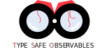

# Observe
> **Simply observe any variable in Deno** <br>


## Example
```JavaScript
let obs = new Observe("initial value"); // new observable with type String

obs.bind((data) => { // bind to receive updates on value change
    // Do some stuff here (data here is of type string)
});

obs.setValue("another value"); // sets the value
```
Also check the examples folder for more examples

## Methods
See JSdoc for more information
| Name          | Description      
| ------------- |:-------------:
| getValue()    | Returns the current value. To be used outside of callbacks
| getHistory()  | Gets the change history. Every time a new value is set it is pushed to a history array
| bind()        | used to listen to changes. Takes a callback method that is called with the new data when the observe instance changes. **Returns the function used for the event listener.. To be used with the unBind method (see below)**
| unBind()      | Unbinds a previously bound EventListener or EventListenerObject. The callback returned by bind() should be provided
| setValue()    | Updates the observed value.. all bound will be notified. Setting a value equals to the last set value will do nothing.
| stop()        | prevents event from reaching any registered event listeners after the current one

## Testing
```Shell
deno run test
```
